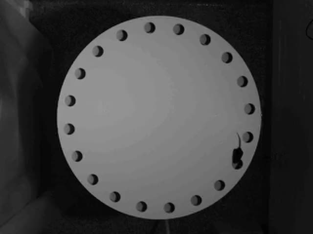

# Sample data — Barnes maze

Three recordings of mice running a Barnes maze, for use in
[Task 1](../../tasks/01-barnes-maze.md).

## Files

| File | Frames | Frame rate | Duration | Size |
|---|---|---|---|---|
| `test50.mp4` | 5,539 | 30 fps | 3:05 | 3.0 MB |
| `test51.mp4` | 741 | **14.985 fps** (`15000/1001`) | 0:49 | 448 KB |
| `test53.mp4` | 905 | 30 fps | 0:30 | 540 KB |

All three are 640×480, H.264, `yuv420p`, no audio. The source is a grayscale
overhead camera, so the color channels carry no information.

**Note the frame rates.** `test51.mp4` is not 15 fps, it is 15000/1001 ≈ 14.985
fps, which is the sort of thing that quietly turns a latency of 30.0 s into
30.06 s. Anything you report in seconds has to come from the file's own
timebase, not from an assumption.

We re-encoded these from the originals to keep the repo small (70 MB → 4 MB) and
to put a keyframe every 15 frames, which makes frame-accurate seeking in a
browser far less painful. Frame counts are preserved exactly. Visual quality is
lower than the originals; if that turns out to matter for your approach, say so
in your README — that is a legitimate finding, not a complaint.

## What you are looking at

A standard 20-hole mouse Barnes maze, filmed from above:

- A circular white platform with **20 evenly spaced holes** around the rim.
- One hole is the **target**, leading to a dark escape box under the platform.
  The other 19 are false and open onto nothing.
- A **dark mouse** on a white surface — high contrast, which makes this an
  unusually friendly tracking problem.
- The platform does not fill the frame, and the rig around it is visible.

## Things that will bite you

Found by hand; not exhaustive, and finding the rest is part of the exercise.

- **The mouse goes into holes.** It disappears entirely for stretches, then
  reappears. That is not a tracking failure — it is the single most important
  event in the whole assay, and your pipeline has to be able to tell the
  difference between the two.
- **Occlusion at the rim.** Near the platform edge the mouse is partly cut off
  by the hole it is investigating.
- **The tail.** Long, thin, high-contrast, and it will wreck a naive
  centroid-of-dark-pixels approach. A body centroid and a nose are different
  points and the assay cares about the difference.
- **Lighting is uneven** across the platform, and there are specular highlights.
- **A cable and hardware are visible** at the edge of frame in some clips.
- **The three clips are not interchangeable.** Look at all three before you
  commit to an approach. Anything you tune against one video needs to survive
  the other two, and that generalizes well past this folder: the facility has
  hundreds of these recordings and no two sessions are set up identically.
- **No ground truth is included.** Deliberately. Part of the task is letting a
  human decide whether the output is trustworthy.

## Provenance

Recorded at the Salk Institute in 2024 as pilot data for a Barnes maze pipeline.
Use them freely for this exercise.

Please link back to this repository rather than committing copies into your own
— that keeps your submission small, and means you are always pointing at the
same files we are looking at.

If your submission needs to show output, showing it on these clips is exactly
what we want to see.
